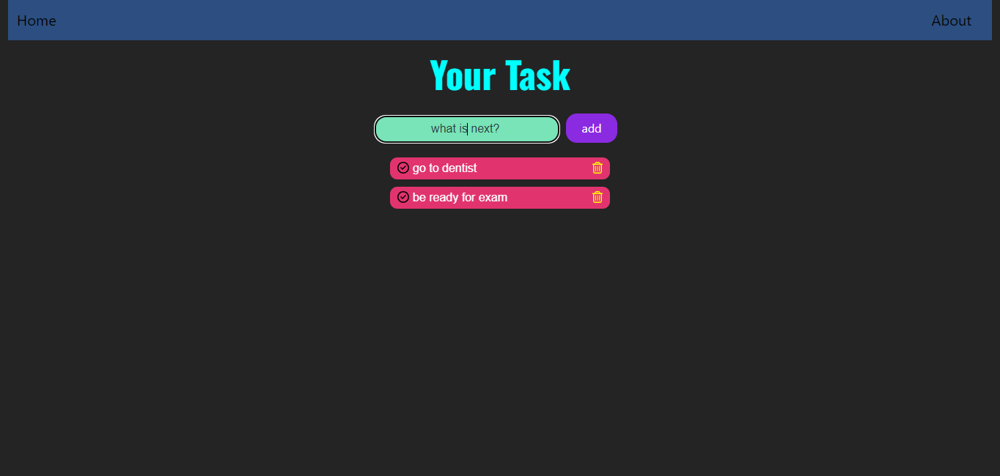

# Simple Todo App

A simple and efficient Todo app built with React, TypeScript, SCSS, React Router, and Bootstrap.

## Features

- Add tasks to your todo list
- Mark tasks as complete
- Delete tasks from the list

## Project Setup

### Installation

To install and run the project locally, follow these steps:

1. Install Node.js and npm
First, make sure you have Node.js and npm installed. You can download and install them from the official Node.js website.

2. **Clone the repository:**

    ```bash
    git clone https://github.com/j2a1ck/React-Todo-App.git
    ```

3. **Navigate to the project directory:**

    ```bash
    cd REACT-TODO-APP
    ```

4. **Install dependencies:**

    ```bash
    npm install
    ```

5. **Start the development server:**

    ```bash
    npm start
    ```

The app should now be running on `http://localhost:5173`.

## Usage

Once the app is running, you can:

- **Add a task:** Enter a task in the input field and press the "Add" button.
- **Complete a task:** Click the checkbox next to a task to mark it as complete.
- **Delete a task:** Click the "Trash" icon next to a task to remove it from the list.

## Technologies Used

- **React**: A JavaScript library for building user interfaces
- **TypeScript**: A typed superset of JavaScript that compiles to plain JavaScript
- **SCSS**: A CSS preprocessor that adds special features such as variables, nested rules, and mixins
- **React Router**: A library for routing in React applications
- **Bootstrap**: A CSS framework for designing better web pages

## Screenshots



## Contributing

If you'd like to contribute to this project, please fork the repository and use a feature branch. Pull requests are welcome.

1. Fork the project
2. Create your feature branch (`git checkout -b feature/YourFeature`)
3. Commit your changes (`git commit -m 'Add some feature'`)
4. Push to the branch (`git push origin feature/YourFeature`)
5. Open a pull request

## Contact

If you have any questions or need further assistance, feel free to contact at [email](jack.70aw@gmail.com). 

---
